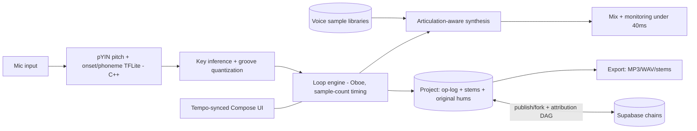

# Loopwright — the song in your head, out loud

Everyone has melodies. Almost no one has instruments, theory, or a DAW they understand. The gap between "I hummed something in the shower" and "I made a song" is one of the cruelest in all of creative software — the tools either toy-ify music into meaninglessness or professionalize it into a cockpit. Loopwright closes the gap with the oldest interface there is: your voice. Hum a melody and it comes back as a felt piano. Beatbox a rhythm — *boots and cats* — and it comes back as drums. Layer loops like a busker with a loop pedal, mute and un-mute layers live like a producer, arrange scenes into a song with one finger. Ten minutes after installing, a person who has never played anything has made something that sounds — genuinely, shareably — like music.

## 1. Overview
- **Elevator pitch:** A pocket looper for non-musicians: hum-to-instrument and beatbox-to-drums transcription with forgiving musical quantization and key-snapping, a loop-pedal mental model (record, overdub, mute live), a small curated palette of characterful instrument voices, one-finger song arrangement, and remix chains where shared songs carry forkable stems with attribution.
- **Category:** Music & Audio — creation tool.
- **Tagline:** *The song in your head, out loud.*
- **Play Store positioning:** "Hum it. Loop it. It's a song now."

## 2. Problem & Why Now
Music creation apps serve two poles and abandon the middle. Toys (endless "make a beat" tap games) produce nothing you'd replay tomorrow; DAWs (FL Studio Mobile, BandLab's full editor) demand vocabulary — quantization, velocity, piano rolls — that filters out exactly the people with the most unexpressed music in them. The middle — *musical intent without musical training* — is enormous: billions hum; TikTok made 15-second original audio a folk form; "songs I made up in my head" is a recurring viral genre of people singing over nothing, begging for accompaniment. Why now, technically: on-device pitch tracking is classical DSP (robust, fast), monophonic hum-to-MIDI is a solved research problem (Google's own experiments proved the interaction), percussive onset classification (kick/snare/hat from beatbox phonemes) runs comfortably in real time on mid-range phones, and low-latency Android audio (Oboe/AAudio) finally makes loop-pedal timing feel right. Why now, culturally: the loop pedal itself became a star (Ed Sheeran, Marc Rebillet, the entire busker-YouTube economy) — the mental model Loopwright borrows is one its audience has already watched a thousand times.

## 3. Target Audience & Personas
- **Zainab, 19, student, Birmingham.** Sings constantly, owns no instruments, believes "I'm not musical" because school said so. Records a hummed hook over beatboxed drums on the bus; the felt-piano version of her own melody makes her cry a little. Posts it; the audio gets used by 40 classmates. She is the product's reason.
- **Marcus, 38, ex-band guitarist, dad of two, Denver.** Sold the amps years ago; the itch remained. Ten-minute sessions after bedtime: hums basslines, stacks loops, rebuilds the songs his band never finished. Buys the yearly sub the night he exports a track to his old bandmate with the message "remember this one?"
- **Dev & Ana, 26 & 24, content-creator couple, São Paulo.** Need original audio constantly (copyright strikes ended their licensed-music era). Loopwright is their jingle factory: 30-second loops for every video, remix chains with their audience as engagement. The commercial-use clarity in licensing (your creations are yours) is why they stay.

## 4. Core Concept Deep-Dive
**Transcription that forgives.** The pipeline's design principle: *the user is always in tune, retroactively.* Hum capture → pitch contour → note segmentation → **key inference** (the app detects the key you're implying and snaps notes to it — wobbly humming becomes confident melody) → **groove quantization** (onsets snap to the grid *with feel preserved*: a swing-detection pass keeps your timing's character while fixing its sloppiness). Beatbox capture classifies percussive phonemes (b/p → kick, k/t → snare, ts/ch → hats, brr → rolls) with the same groove-preserving snap. The result never sounds robotic because quantization strength is musical, not absolute — and the user never sees a settings page about it (a single "tighter/looser" slider exists in the loop's edit sheet for the curious). Crucially, **the original voice memo is always kept** — one tap A/Bs your hum against its instrument rendering, which is both a trust feature and the app's single most magical demo moment.

**The loop pedal is the interface.** One screen, one big central pad: tap to record (count-in pulse), tap to close the loop — it immediately plays, cycling; tap again to overdub the next layer. Layers stack as a ring of glowing segments around the pad; press any segment to mute/unmute *live* (the performance gesture — muting and dropping layers back in is 80% of what makes looping feel like music-making, and it costs zero theory). Tempo is inferred from your first loop; everything after conforms. Undo pulls the last layer off. The entire core loop is learnable in ninety seconds because its referent — the busker's pedal — is already in cultural memory.

**A small palette with soul.** Eight launch voices, each with genuine sound-design character and a human name: **Felt** (intimate piano), **Dust** (lo-fi synth, tape-warble), **Upright** (acoustic bass with fret noise), **Brass Sunday** (soft horn section), **Choirette** (your melody as stacked oohs), **Nylon** (bedroom guitar), **Glass** (music-box celesta), **Kit** & **Cardboard Kit** (drum voices: tight studio vs. hit-a-box charm). No 500-instrument browser — curation is the feature (the Pigment palette philosophy: fewer, deeper, characterful). Each voice responds to *how* you hummed: breathy → softer articulation, staccato syllables → plucked attacks. Melodies can be re-voiced after the fact with one tap (hear your hook as Choirette; keep both).

**Scenes and Song mode.** A set of loops = a **scene** (your verse); duplicate and vary it (mute two layers, add one) = another scene (your chorus). Song mode is a horizontal strip of scene blocks — drag to order, pinch to set repeats, done: structure without arrangement theory. A gentle **auto-arrange** offer ("want a shape? intro–verse–chorus–verse–chorus–out") exists for the fully lost, always editable, never default.

**Remix chains — SoundCloud meets git.** Share a song and it carries its **stems** (the layers, as remixable objects) unless you lock them. Anyone can fork: keep the drums, replace the melody with their own hum, republish — with the attribution chain intact and visible ("Zainab's hook → Dev's flip → 12 more"). Chains make every shared song a seed, not a artifact; the Ferment/Axiom lineage instinct applied to music, where it's most native (remix culture already runs on exactly this psychology, minus the plumbing).

## 5. Complete Feature Set
**MVP (v1.0):**
- Hum-to-instrument + beatbox-to-drums live transcription; key inference; groove quantization with feel preservation; original-voice A/B.
- Loop pad: record/overdub/close, 8 layers, live mute ring, per-layer volume/re-voice/tighten, undo stack, tempo inference + metronome-pulse count-in (haptic).
- 8 voices; scenes; Song mode with drag arrangement + repeats.
- Export: mixed MP3/WAV, per-stem export, direct share sheet; local project library.
- Sessions fully offline; 10-minute "first song" guided path (optional, dismissible).
**v1.x fast-follows:**
- Remix chains platform: publish with stems, fork, attribution trees, chain browsing (accounts arrive here, optional before).
- 4 more voices (incl. **Saw** — the EDM ask — and **Strings**); FX per layer (echo, warmth, radio) as simple named toggles, not knob-boards.
- Live jam over speaker with a friend's phone (sync two devices, one tempo — party feature with outsized share value).
**v2.0+:**
- Lyric layer: record actual sung vocals (not transcribed — kept as voice) over the instrumental with one-tap tuning-assist (gentle, never full-autotune-plastic by default).
- MIDI export + Ableton Link (the "graduation" path — Loopwright feeds the DAWs it refuses to become; goodwill and retention among leveling-up users).
- Chain challenges: weekly seed loops from featured artists; community flips (the Pigment limited-palette instinct as A&R).

## 6. Screen-by-Screen UX Walkthrough
Navigation: three surfaces — **Pad** (the instrument, default), **Songs** (library + Song mode), **Chains** (v1.x community) — with settings tucked away.
- **Pad:** the big central pad, layer ring around it, voice picker as a horizontal shelf of eight tiles below, tempo/key readout whispered at top (tap for tap-tempo/key override — hidden depth for the 10%), record state coloring the whole screen subtly (recording = warm bloom). Everything reachable one-thumbed; the phone held like a phone, not a mixing desk.
- **Layer sheet (long-press a ring segment):** volume, re-voice carousel with live preview, tighter/looser, original-voice A/B toggle, delete.
- **Songs:** project cards with waveform-ring thumbnails; Song mode strip editor; export sheet (mix/stems/quality); rename with suggested names generated from key + voice ("Felt in F minor" placeholder — users keep them, oddly).
- **Chains (v1.x):** chain trees rendered like family trees (Ferment kinship), play-in-place, fork button, your-chains shelf.
- **First-song path:** four cards overlaying the Pad in sequence — "hum anything for 4 seconds" → melody plays back as Felt (the gasp moment, engineered to arrive inside 90 seconds) → "now the drums: say boots-and-cats" → "mute the piano, bring it back — feel that?" → "that's a song. want a chorus?" Completion lands in Song mode with a two-scene structure already built from their material.
**Key flow — the bus session:** headphones in → Pad → hum over count-in → 8-second loop cycling as Upright → beatbox hats overdubbed → Dust pad chords (hummed as three long notes, chord-ified by the app's one harmony assist: long low hums become root-position chords in key) → mute-play performance for two minutes → save → export → WhatsApp to the group chat. Total: eleven minutes, zero theory, one song.
**Key flow — the fork:** Zainab's chain link opens Dev's app to the chain page → play → fork → her drums stay, his melody replaces hers via fresh hum → publish → the tree grows a branch; she gets the only notification type in the app worth having ("someone flipped your hook").

## 7. Design Language
Instrument warmth over studio cool: deep charcoal stage with warm brass and felt-orange accents; the layer ring glows like tube amps; voice tiles are tactile little objects with texture (felt, dust, glass — the names made visible). Type: a rounded-but-serious grotesk (General Sans) with big musical numerals for tempo. Motion: everything pulses *on the beat* — the entire UI is tempo-synced (buttons breathe at the song's BPM; this one decision makes the app feel alive and musical in a way no static mixer ever does). Sound design: the UI itself is mixed like an instrument — count-in clicks in key, save chime as a resolved chord in the project's key. Haptics: beat-synced count-in pulse, a soft thunk on loop-close (the pedal stomp, honored). The aesthetic north star: a beautiful instrument, not a small studio.

## 8. Technical Architecture
Opinionated stack: **Kotlin + Jetpack Compose** UI over a **C++ audio core (Oboe)** — the loop engine, transcription pipeline, and synthesis must live below the GC line; round-trip latency budget: record-tap to monitoring < 40ms on tier-1 devices, loop-boundary drift zero by construction (sample-count arithmetic, never clock time). Transcription: pitch via pYIN (C++), onset/phoneme classification via a compact TFLite model (trained on a commissioned beatbox dataset — a real but bounded data effort: ~50 hours across accents/ages/mic qualities), key inference via Krumhansl-style profiles over the running session; all on-device, all real-time. Synthesis: hybrid — sample-based voices (multi-velocity, round-robin; the recording budget IS the product budget: ~$15k for eight voices recorded properly) with a lightweight DSP layer for articulation response. Projects: op-log + stems in local storage (Room index), export via on-device encode. Chains (v1.x): **Supabase** — projects publish as stem bundles + attribution DAG; audio streaming via CDN with range requests (chains are small: stems, not masters). Everything core is offline; accounts exist only for chains.

## 9. Data Model
- **Project:** `id`, `title`, `key`, `bpm`, `scenes[]`, `song_strip[{scene_id, repeats}]`, `created/updated`, `chain_ref?`.
- **Scene:** `id`, `layers[]` (ordered ring).
- **Layer:** `id`, `voice_id`, `notes[{pitch, start_tick, len, articulation}]` (or `hits[]` for drum layers), `original_audio_ref` (the hum — always kept), `volume`, `muted`, `quantize_strength`, `fx[] (v1.x)`.
- **Voice (content):** `id`, `name`, `family{melodic|drum}`, `sample_bank_ref`, `articulation_map`, `tier{free|plus}`.
- **ChainNode (v1.x):** `id`, `project_snapshot_ref`, `parent_node_id?`, `author_id`, `stems_locked:bool`, `plays`, `forks`.
- **UserPrefs:** `default_voice`, `count_in_beats`, `latency_calibration`, `haptic_level`.

## 10. Monetization
Freemium subscription with a musician's-honor free tier. **Free forever:** full transcription magic, loop pad with 4 layers, 4 voices (Felt, Kit, Upright, Dust — a genuinely gig-able quartet), scenes, Song mode, MP3 export with a tasteful audio watermark-free policy (no audio watermarks ever — stamping someone's song is vandalism; the export simply includes "made in Loopwright" metadata) but capped at 3 exports/month. **Loopwright Plus — $5.99/month or $34.99/year** (₹199/₹1,199): 8 layers, all voices + monthly voice drops, unlimited exports, stem export, FX, live jam, priority chain features. Voice packs occasionally à la carte ($2.99) for collectors. Conversion logic: layer 5 is the honest wall (arrangements naturally want a fifth voice — the wall arrives mid-creativity, converting desire rather than blocking necessity), export cap catches the creator cohort (Dev & Ana convert week one), and voice drops give subscribers a monthly gift that markets itself in chains (non-subscribers *hear* new voices in forked songs — audible FOMO, the most native upsell in music). Commercial use of your own creations: always yours, all tiers, stated plainly (creator trust = the Dev & Ana channel). Targets: 5–7% of week-2 retained to Plus; chains participation doubling conversion among its users (measure it).

## 11. Play Store Listing
- **Title (≤30):** `Loopwright: Hum to Song` (23)
- **Short description (≤80):** `Hum a melody, beatbox a beat — loop them into real songs. No theory needed.` (74)
- **Full description:** open with the shower-melody tragedy; blocks: Your Voice Is the Instrument (transcription, the A/B moment), Loop Like a Busker (the pedal model, live muting), Eight Voices With Soul (the palette, named), From Loop to Song (scenes, one-finger structure), Songs That Grow (chains, attribution, forking), Yours to Keep (offline, commercial-use clarity, no audio watermarks). Close with Zainab's arc compressed to two sentences.
- **ASO keywords:** hum to music, make songs easy, loop pedal app, beatbox drums, music maker no instruments, song ideas recorder, melody to instrument, looper, easy music creation, voice to midi.
- **Content rating:** Everyone. Chains (v1.x) → UGC declarations, report/block, DMCA process (music UGC makes copyright handling a real operational function — counsel-reviewed takedown flow before chains ship).
- **Policy notes:** mic permission in-context; Data safety: audio processed on-device, uploads only on explicit publish; chains content moderated (audio fingerprinting on publish against known-work DBs is worth the API cost to keep the platform clean of ripped melodies — protects users AND the store standing).

## 12. Growth & Marketing Plan
The output is audio and audio travels. (1) The A/B demo is the campaign: side-by-side "my hum / the song" clips are engineered viral material — seed 30 creators across "I can't sing" TikTok, dad-rock YouTube, and beatbox communities (who will stress-test and adore the phoneme engine, then showcase it). (2) Original-audio economics: creators fleeing copyright strikes need original loops — position Loopwright as the jingle machine for small creators (Dev & Ana content: "I made my outro music on the bus"); the exported track's metadata carries discoverable attribution. (3) Chains as A&R theater (v1.x): weekly featured seed from a known artist (a bassline from a respected session player; a hook from a rising singer) — flips compete, best branches showcased; cheap, endlessly renewable, community-building content. (4) The busker bridge: loop-pedal YouTube's audience already understands the interface — sponsorships with looping performers demoing phone-vs-pedal duets. (5) School/youth-program goodwill: a free classroom mode pack (project sharing without accounts) — music education budgets died; a phone per pair of kids is what's left, and the goodwill compounds (also: Zainab was in that classroom). Review-ask discipline: once, after a user's first 3-scene song export — the proudest moment.

## 13. Analytics & KPIs
North star: **songs (multi-scene projects) completed per weekly-active user** (target ≥ 0.8 — completion over noodling; loops are fun, songs retain). Key events: `first_loop_closed{seconds_from_install}` (target median < 4 min), `gasp_ab_used` (original-vs-instrument A/B — the magic's proxy), `layers_per_scene`, `layer5_wall_hit`, `scene_duplicated` (structure behavior emerging), `song_exported{format}`, `export_cap_hit`, `voice_revoiced`, `plus_started{trigger: layer5|export|voices}`, `chain_published/forked{depth}`, `original_audio_kept_rate`. Thresholds: first-loop-closed ≥ 65% of installs (the ninety-second promise, measured); A/B usage ≥ 50% of first sessions; D7 ≥ 30%; multi-scene rate ≥ 40% of D7 users; free→Plus ≥ 5%; chain fork rate ≥ 15% of published songs; latency complaints < 1% of reviews on tier-1 devices (the C++ core's report card).

## 14. Risks & Mitigations
- **Transcription disappoints on real-world humming (the make-or-break):** the forgiveness pipeline is the product — key-snap + groove-preservation tuned on a commissioned diverse hum corpus (not the developer's own humming; the classic trap), the A/B keeps trust honest, and per-layer "tighter/looser" gives an escape hatch. Beta gate: 70% of first-time users must rate their first playback "sounds like what I meant" or the pipeline iterates before launch.
- **Latency on Android's device zoo:** Oboe + calibration on first run, device-tier profiles, monitoring-path fallbacks; the loop engine's sample-count architecture keeps *musical* timing perfect even when monitoring lags (layers align in the render regardless).
- **Voice-palette cost/quality:** eight voices recorded properly beats twenty thin ones; the budget is protected in the plan and the drops cadence amortizes further investment.
- **Copyright mess in chains:** fingerprint-on-publish, DMCA ops, stems-locked option, attribution DAG as cultural pressure toward credit; launch chains regionally staged to keep moderation humane.
- **"Toy" perception ceiling:** the palette's sound quality, the busker-culture positioning, and the MIDI/Link graduation path (v2) signal instrument, not toy; marketing never says "fun" without playing the audio.
- **Platform competition (BandLab et al. adding hum features):** incumbents' DNA is the full DAW — their hum feature will be a menu item inside a cockpit; Loopwright's moat is the single-screen instrument discipline plus the forgiveness pipeline's craft. Hold the line the way Sentence holds its constraint.

## 15. Competitive Landscape
- **BandLab:** the giant (free DAW + social); powerful, cluttered, intimidating to the very users Loopwright serves; its social graph is real — chains compete on lineage-warmth, not scale; expect coexistence (Loopwright exports can even land in BandLab — graduation, not war).
- **GarageBand (iOS-only):** the platform gold standard that Android simply lacks — its absence on Play is Loopwright's Procreate-gap (the Pigment lesson repeating); Live Loops validated the scene/grid model for civilians.
- **Groovepad / beat-toy apps:** huge installs, canned loops, zero authorship — they harvest the audience's desire and return none of the pride; Loopwright's pitch against them is one word: *yours*.
- **Moises / vocal-tool apps:** adjacent AI-audio utilities proving willingness to pay for voice-centric magic; different job, useful market signal.
- **Hum-to-search / hum experiments (Google):** proved the interaction delights; shipped nowhere creative; validation without a competitor.

## 16. Development Plan
Solo dev + audio engineer (contract, the C++ core and voice recording) + the beatbox-corpus effort, ~28 weeks to v1.0. W1–4: Oboe loop engine (record/overdub/mute with sample-perfect boundaries) + latency calibration; a playable no-transcription looper exists by week 4. W5–9: transcription pipeline — pYIN integration, segmentation, key inference, groove quantization; corpus collection runs parallel (commissioned, consented, paid contributors). W10–12: beatbox classifier training + integration; the boots-and-cats demo works end-to-end. W13–15: synthesis layer + first four voices recorded and mapped (Felt first — the gasp depends on it); articulation response. W16–17: Pad UI with tempo-synced motion, layer ring, first-song path. W18–19: scenes, Song mode, export pipeline. W20–21: remaining four voices, layer sheet, re-voicing. W22–24: closed beta (400 users, weighted heavily toward self-described non-musicians; the "sounds like what I meant" gate governs). W25–26: monetization, polish, store assets + the A/B launch film (one uncut take: a hum in a kitchen becoming a three-layer song, 45 seconds). W27–28: buffer + launch. Chains ship the following quarter behind the moderation ops being genuinely ready. **If behind:** cut two voices, live jam, and auto-arrange — never cut the A/B feature, the forgiveness pipeline's tuning time, or the latency budget.

## 17. Moonshots
- **The duet engine:** hum harmony against your own melody with real-time pitch guidance — the app teaches interval-singing without ever saying "interval" (music education smuggled inside play, the Axiom instinct).
- **Voice cloning of instruments, ethically:** record 10 minutes of *your* guitar/violin/whatever and make it a personal voice (on-device training, your instrument stays yours) — the palette becomes personal heritage; grandma's piano, sampled, outliving the piano (Heirloom kinship).
- **Live-looping performance mode:** external pedal/MIDI-footswitch support + projector-friendly visuals — Loopwright on stage at open mics; the busker bridge completed in the other direction.
- **The hummed-hook marketplace:** creators license original hooks/loops to each other with chain-attribution royalties — SoundCloud-meets-git grows a Bandcamp limb; operationally heavy, culturally enormous if earned.
- **Score-free notation:** export any song as an illustrated "how to play this" sheet (colored rings and voice names, no staves) — so the campfire guitarist friend can join in; notation for people the stave forgot.
